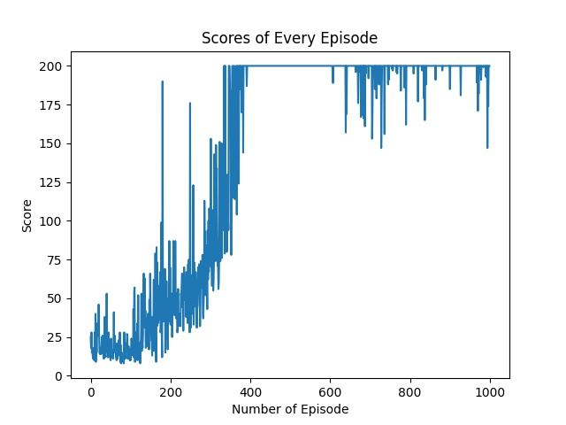
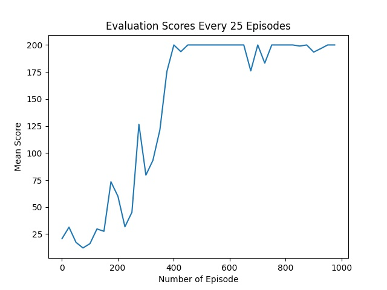
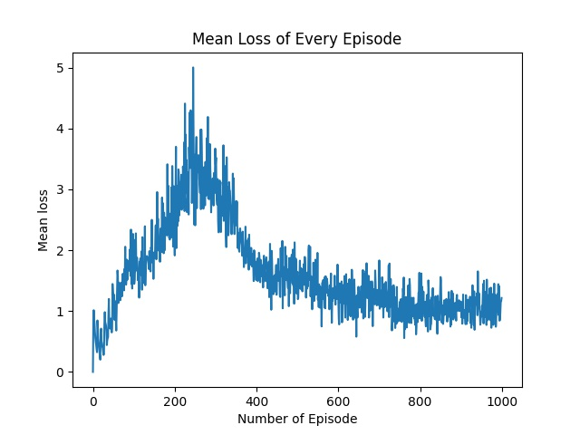
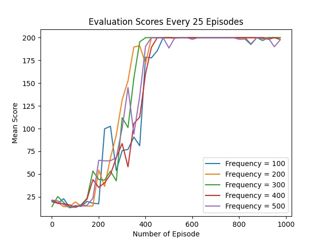

# Reinforcement Learning DQN Project 🎮
This directory contains all code needed to train an agent to play Pong or CartPole.

The **models/permanent** directory contains models for CartPole and Pong trained during 1000 episodes, and Pong during 3000 episodes. These all use the default parameters.

In order to run the 3000 model, some lines in the **forward** function in **DQN.py** need to be commented out, see the file for details. This is due to the network being extended to also support CartPole after training this agent.

---

# Introduction

## Description of DQN

DQN(Deep Q-learning) combines neural networks and Q-learning. This new
method is proposed because there is a bottleneck in the traditional form
of reinforcement learning. If we use tables to store each state and the
Q value of each behavior in this state, no matter how much memory the
computer has, it won’t be enough. Even with enough memory, searching the
corresponding status in the table is also a time-consuming thing. That
is why there is a need to use a function approximator for practical
purposes, which can give a good enough optimal value function following
a policy \(\pi\). In machine learning, neural networks are good at this
kind of work. We can take the state and action as the input value of a
neural network, and get the Q value of action after neural network
analysis. There is no need to record the Q value in the table and
directly generate the Q value in the neural network. A slight variation
of this approach is to only take state as an input and give all the
action value pairs as an output. According to the principle of
Q-learning, DQN will directly select the action with the maximum value
as the next action to be done.  
\[Q(s, a) \leftarrow Q(s, a)+\alpha\left[r+\gamma \max _{a^{\prime} \in \mathcal{A}} Q\left(s^{\prime}, a^{\prime}\right)-Q(s, a)\right]\]
DQN has two major advantages over standard Q-learning update,ie.
experience replay and fixed Q-targets. DQN has a memory bank to learn
from previous experiences by storing transitions. Q-learning is an
off-policy learning method. Every time DQN is updated, experience replay
can randomly extract some previous experiences for learning. This random
extraction method disrupts the correlation between experiences and makes
the neural network update more efficient. Target network is also an
incentive to disturb the correlation. It uses two neural networks with
the same structure but different parameters in DQN. The neural network
for predicting Q estimation has the latest parameters, while the neural
network for predicting Q reality uses an older set of parameters.

# DQN for CartPole-v0

## CartPole Description

In the pole environment, there is a small car. The task of the agent is
to keep the pole vertical by moving left and right. The state of an
agent is a vector with continuous dimension 4, its action is discrete,
and the size of the action space is 2 (moving left or right). The game
will end if the inclination of the pole over angle limitation, or the
left and right deviation of the car from the initial position is too
large, or the persistence time reaches 200 frames. For each frame in the
game, the agent will be rewarded with a score of 1. The longer the
persistence time, the higher the final score. The highest score can be
obtained by adhering to 200 frames.

## Default Hyperparameters

Our CartPole experiment is implemented in Google Colab. We use the
following default hyperparmeters to train the DQN.

|                         |             |                                                                      |
| :---------------------- | :---------- | :------------------------------------------------------------------- |
| Hyperparameter          | Value       | Description                                                          |
| Memory size             | 50000       | Maximum size of the replay buffer.                                   |
| Batch size              | 32          | Size of mini-batches sampled from the replay buffer.                 |
| Target update frequency | 100         | The frequency (measured in time steps) to update the target network. |
| Train frequency         | 1           | The frequency (measured in time steps) to train the network.         |
| Gamma                   | 0.95        | Discounted factor gamma used in the Q-learning update.               |
| Epsilon start           | 1           | Starting value of \(\epsilon\)-greedy exploration.                   |
| Epsilon end             | 0.05        | Final value of \(\epsilon\)-greedy exploration.                      |
| Anneal length           | \(10^{4}\)  | Value of steps to anneal epsilon for                                 |
|                         |             | eps\_step = (eps\_start - eps\_end) / anneal\_length                 |

## Experiment Results

We plot the relationship between the number of episode and score. In
figure 1 and 2, after 200 episodes, score or the mean score increases
and becomes stable after 400 episodes. The stable mean score approaches
to 200. The score is low when the agent starts learning, then it reaches
200, which is the maximum score can be achieved in the CartPole
environment.

   
The figure 3 plots the number of episode and mean loss. The loss
increases till 300 episode, the loss begins to decrease after 300
episodes, showing that the network is learning. The mean loss seems to
remain steady if we ran more episodes, so as we can see on figure 1 and
2, the score reaches maximum 200 after 400 episodes.

Two hyperparameters are tuned in the CartPole. The first one is **batch
size**. We tried 5 different batch size in the experiment, range from 10
to 70. The result is showed in Figure [4](#fig:batch_size), which shows
that the lower batch size has worse performance, while the higher batch
sizes perform better. The overall performance of higher batch sizes
(large than 10) seems no much difference in one running of experiment,
but if we look at the performance after its mean score reaches 200,
there is a trend that higher batch size brings higher variance. Another
hyperparameter we tuned is **target update frequency**. Again, we tried
5 increasing frequency, range from 100 to 500. The result is showed in
Figure [5](#fig:frequency). The fastest agent that converges the mean
score to 200 is the one with frequency 300 and it has lower variance
after the convergence compared to other agents. The slowest agent is the
one with frequency 100 and it also has a low variance compared to the
agents with high frequency. The agent with frequency with 500 has the
highest variance after the convergence. Although there are some
difference between theses agents, we are not sure the differences are
because of different frequency or just the variance.

.jpg)

# DQN for Pong 🏓

## Pong Description

Pong is a two-dimensional tennis video game with 2.5 million frames (210
× 160 pixel images, 128-color each pixel). Two players control the
paddles to hit a ball vertically across the left or right side of the
screen. The agent is on the right and the opponent on the left. One
player gets a score when the other player fails to return the ball. The
agent receives a +1 reward if the opponent missed the ball, a -1 reward
if it fall to pass the ball, and 0 otherwise. An episode ends if one of
the players earns 21 points.

## Experiment Results

The DQN implementation supporting both Pong and CartPole can be seen in
the listings in Section [5](#implementation). The Pong implementation
differs in that it uses an observation stack in order to have four
subsequent frames as input to the DQN. Unlike using only one frame, this
provides information about the velocity of the ball. The implementation
also differs in it using a convolutional neural network instead of only
linear transformations. While the Pong game has six possible actions,
some of which are redundant, the network was designed to only have two
outputs corresponding to moving up and down in order to increase
learning speed.

The default parameters for training the DQN are listed in Table
[1](#table:pong_param). The evaluated score of the model during training
while using these parameters is shown in Figure [6](#fig:default_3000),
and the return for each episode in Figure
[7](#fig:default_3000_returns). The model improves quickly during the
first 1000 episodes, and slower for the second 1000. After 2000 episodes
the performance stagnates. The best performing model is obtained just
before 2000 episodes and when evaluated over 25 episodes, it has a mean
return of \(12.36\).

|                         |             |                                                                      |
| :---------------------- | :---------- | :------------------------------------------------------------------- |
| Hyperparameter          | Value       | Description                                                          |
| Observation stack size  | 4           | The number of frames stacked in a single observation.                |
| Memory size             | 10000       | Maximum size of the replay buffer.                                   |
| Batch size              | 32          | Size of mini-batches sampled from the replay buffer.                 |
| Target update frequency | 1000        | The frequency (measured in time steps) to update the target network. |
| Train frequency         | 4           | The frequency (measured in time steps) to train the network.         |
| Gamma                   | 0.99        | Discounted factor gamma used in the Q-learning update.               |
| Learning rate           | \(10^{-4}\) | The learning rate used for the optimizer.                            |
| Epsilon start           | 1           | Starting value of \(\epsilon\)-greedy exploration.                   |
| Epsilon end             | 0.01        | Final value of \(\epsilon\)-greedy exploration.                      |
| Anneal length           | \(10^{6}\)  | Value of steps to anneal epsilon for                                 |
|                         |             | eps\_step = (eps\_start - eps\_end) / anneal\_length                 |

The default parameters of the Pong DQN.

\[table:pong\_param\]

Some different parameters were tried when training the Pong model.
Figure [8](#fig:target_scores) shows a comparison of different
frequencies for target network updates when training for 1000 episodes.
Except for 5000, the frequencies have similar performance. Due to the
variance in the scores, it is difficult to tell if e.g. the 200
frequency being the last to see initial improvement but then achieves
the highest score is the real behaviour of the model or just due to
variance. Averaging several training runs and training for more episodes
would give a more reliable result. Figure [9](#fig:eps_scores) shows
scores for different number of steps for the anneal length of
\(\epsilon\), while training for 2000 episodes. Annealing over
\(5 \cdot 10^{5}\) and \(10^{6}\) steps have similar performance, with
\(10^{6}\) achieving the best score. The results suggest that these
values ensure enough exploration while not wasting time not exploiting.
However, 2000 episodes may not be enough to draw this conclusion. For
example, \(5 \cdot 10^{6}\) steps may not have the same stagnating
behaviour after 2000 episodes as \(10^{6}\) was shown to have in Figure
[6](#fig:default_3000).

# Discussion

Through this project we came to a conclusion that Deep neural networks
work as a good function approximator and coupled with Replay memory, we
can train agent to learn Cart pole and Pong in a model free environment
by just capturing the frames of the agent playing the game.

Like any other RL algorithm, DQN takes a long time before it starts to
converge and show desired score. It is also challenging to understand
how the convolutional neural network selects features from stacked
frames that are used to find best action value and how the selected
parameters affect the DQN after 2000 episodes as training time
increases.

A future scope of this project can be to extend this method to a number
of Atari games with least amount of hyper-parameter tuning possible to
see if the idea of Deep Q-learning can be generalized over many games
and achieve a superhuman level of performance.

Endtoend.ai. Atari Pong Environment.
https://www.endtoend.ai/envs/gym/atari/pong/

Maciej Balawejder. Solving Open AI’s CartPole Using Reinforcement
Learning.
https://medium.com/analytics-vidhya/q-learning-is-the-most-basic-form-of-reinforcement-learning-which-doesnt-take-advantage-of-any-8944e02570c5

Mnih, V., Kavukcuoglu, K., Silver, D. et al. Human-level control through
deep reinforcement learning. Nature 518, 529–533 (2015).
https://doi.org/10.1038/nature14236

